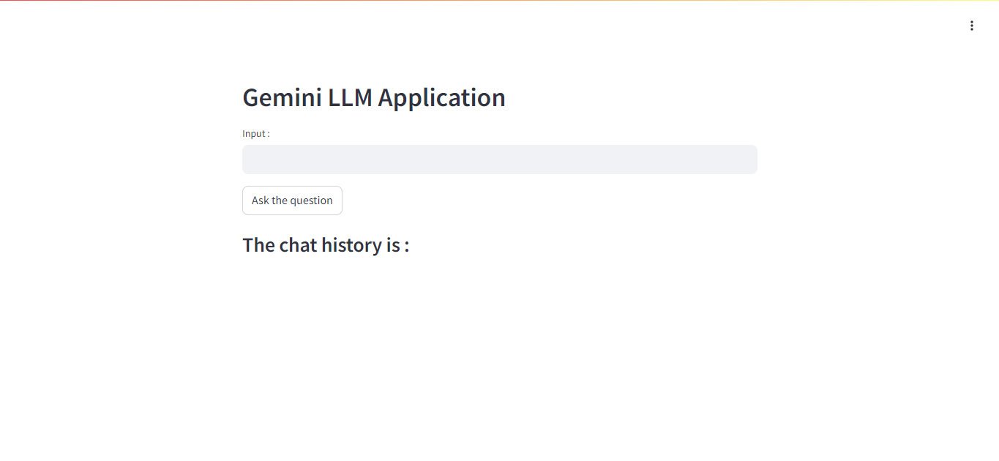
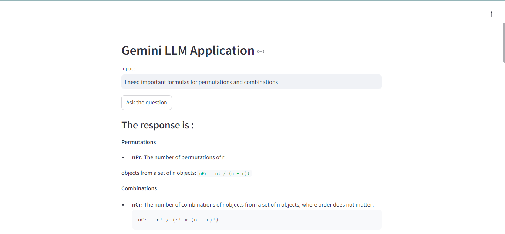

# Image and Text Apps Using Gemini 

Created two apps :  
1.  **App.py** : for text generation and gemini-pro model
2. **Vision.py** : for image and text related questions , it uses gemini-1.5-flash model

**How to Setup**
1. Create a virtual environment  using `virtualenv venv`
2. Start the environment `venv/Scripts/activate` or  `source venv/bin/activate`
3. Install the required packages by running `pip install -r requirements.txt`
4. Add a `.env` file in the directory to  store the  API keys for Gemini 
5.  Run the app using `streamlit run app.py` or `streamlit run vision.py` depending on the app you need

Outputs:
1. Vision.py  
  
  
  
2. App.py  
  
  

Contributed by:  
